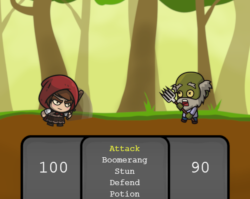

# [Medieval Zombies](https://protected-sierra-25451.herokuapp.com/)

>   THIS GAME IS A CONTINUING WORK IN PROGRESS



---

## Controls

Press SPACE to advance through dialogue<br/>
Use ARROW KEYS to choose action in the battle menu<br/>
Press ENTER to use an action in the battle menu


## About

Medieval Zombies is a short adventure game made with PhaserJS. Choose your adventurer and battle zombies as you unravel the story behind Dreary Cove. 

>   **HINT**: If you prefer npm, run these scripts with `npm run` instead.

```sh
yarn clean     # Manually deletes previous distribution files.
yarn dist      # Prepares the game for distribution.
yarn format    # Uses ESLint to format and remove lint issues.
yarn lint      # Checks scripts for lint issues using ESLint.
```

